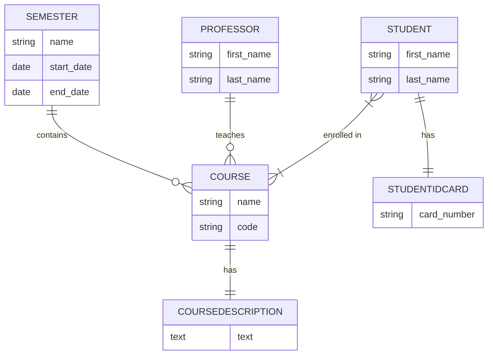

# 🎓 UniversityHub - Django Modeling Project

---

## 📑 Table of Contents / Inhaltsverzeichnis
*   [English Version](#english-version-🇬🇧)
    *   [Project Overview](#project-overview)
    *   [Database Relationships](#database-relationships)
    *   [Setup & Installation](#setup--installation)
*   [Deutsche Version](#deutsche-version-🇩🇪)
    *   [Projektübersicht](#projektübersicht)
    *   [Datenbank-Beziehungen](#datenbank-beziehungen)
    *   [Setup & Installation (DE)](#setup--installation-de)

---

## English Version 🇬🇧

### 🚀 Project Overview
This project focuses on the backend architecture of a university system. Using the [Django Web Framework](https://docs.djangoproject.com), we implemented a relational database schema that maps real-world academic structures.

### 🧬 Database Relationships
We utilized different [Django Model Fields](https://docs.djangoproject.comen/stable/ref/models/fields/) to represent various connection types:
*   **One-to-One (1:1):** `Student` ↔ `StudentIDCard` (Every student has exactly one ID).
*   **One-to-Many (1:N):** `Professor` ↔ `Course` & `Semester` ↔ `Course`.
*   **Many-to-Many (M:N):** `Student` ↔ `Course` (Enrollment system).

#### Schema Diagram

---

### ⚙️ Setup & Installation
1.  **Clone the repo:**  
    `git clone <your-repo-url>`
2.  **Create & Activate Virtual Environment:**  
    `python -m venv .venv`  
    *Windows:* `.venv\Scripts\activate` | *Mac/Linux:* `source .venv/bin/activate`
3.  **Install dependencies:**  
    `pip install django`
4.  **Run Migrations:**  
    `python manage.py makemigrations`  
    `python manage.py migrate`
5.  **Create Admin User:**  
    `python manage.py [createsuperuser](https://docs.djangoproject.comref/django-admin/#createsuperuser)`
6.  **Start Development Server:**  
    `python manage.py runserver`

---

## Deutsche Version 🇩🇪

### 🚀 Projektübersicht
Dieses Projekt konzentriert sich auf die Backend-Architektur eines Universitätssystems. Mithilfe des [Django Web Frameworks](https://docs.djangoproject.com) wurde ein relationales Datenbankschema implementiert, das reale akademische Strukturen abbildet.

### 🧬 Datenbank-Beziehungen
Wir haben verschiedene [Django Model Fields](https://docs.djangoproject.comref/models/fields/) genutzt, um die Verbindungstypen darzustellen:
*   **Eins-zu-Eins (1:1):** `Student` ↔ `Studentenausweis` (Jeder Student hat genau einen Ausweis).
*   **Eins-zu-Viele (1:N):** `Professor` ↔ `Kurs` & `Semester` ↔ `Kurs`.
*   **Viele-zu-Viele (M:N):** `Student` ↔ `Kurs` (Einschreibungssystem).

### ⚙️ Setup & Installation (DE)
1.  **Repository klonen:**  
    `git clone <deine-repo-url>`
2.  **Virtuelle Umgebung erstellen & aktivieren:**  
    `python -m venv .venv`  
    *Windows:* `.venv\Scripts\activate` | *Mac/Linux:* `source .venv/bin/activate`
3.  **Abhängigkeiten installieren:**  
    `pip install django`
4.  **Migrationen ausführen:**  
    `python manage.py makemigrations`  
    `python manage.py migrate`
5.  **Admin-Konto erstellen:**  
    `python manage.py [createsuperuser](https://docs.djangoproject.comref/django-admin/#createsuperuser)`
6.  **Server starten:**  
    `python manage.py runserver`

---

Created with ❤️ during Django Backend Training.